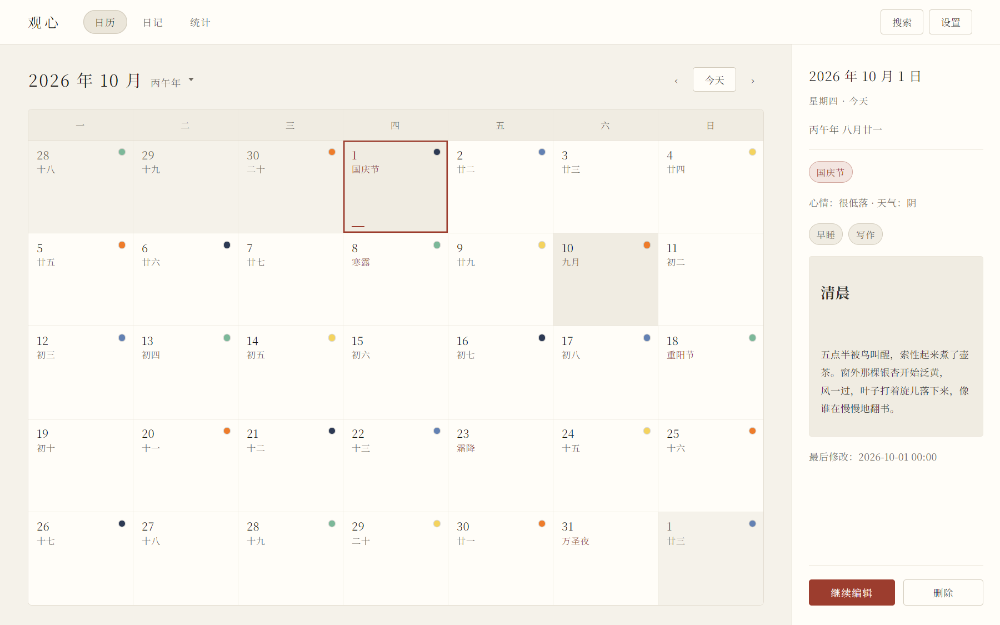
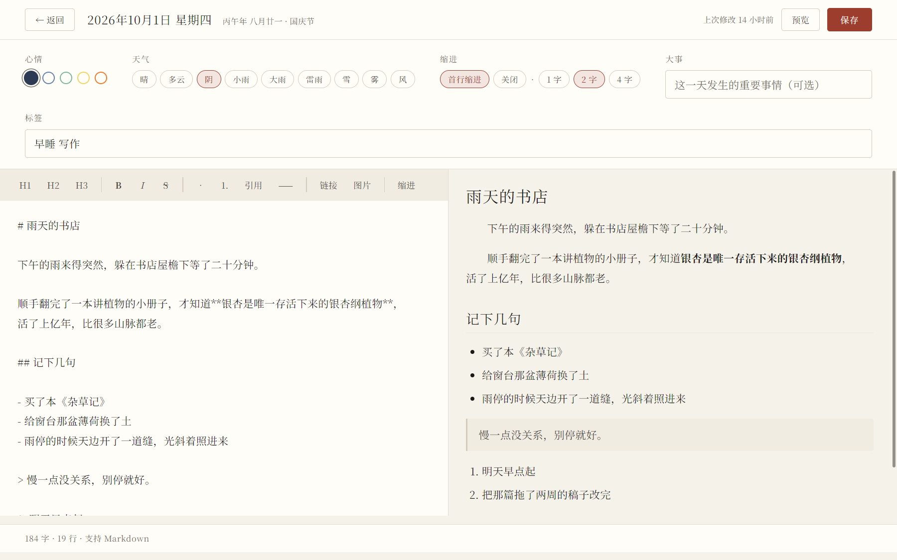
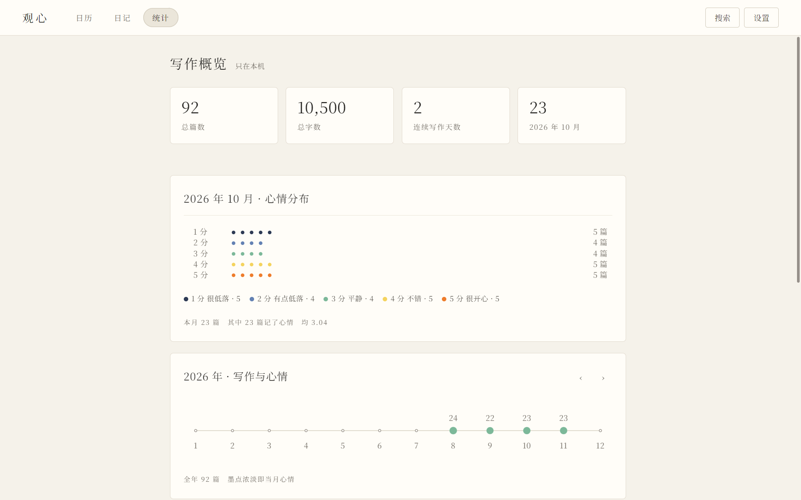
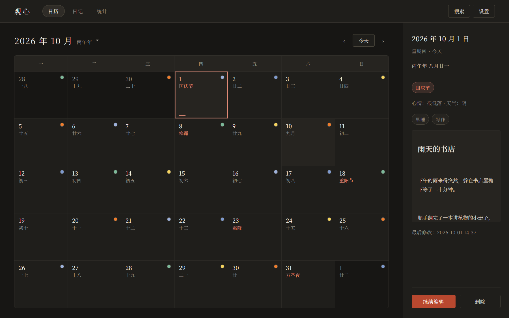
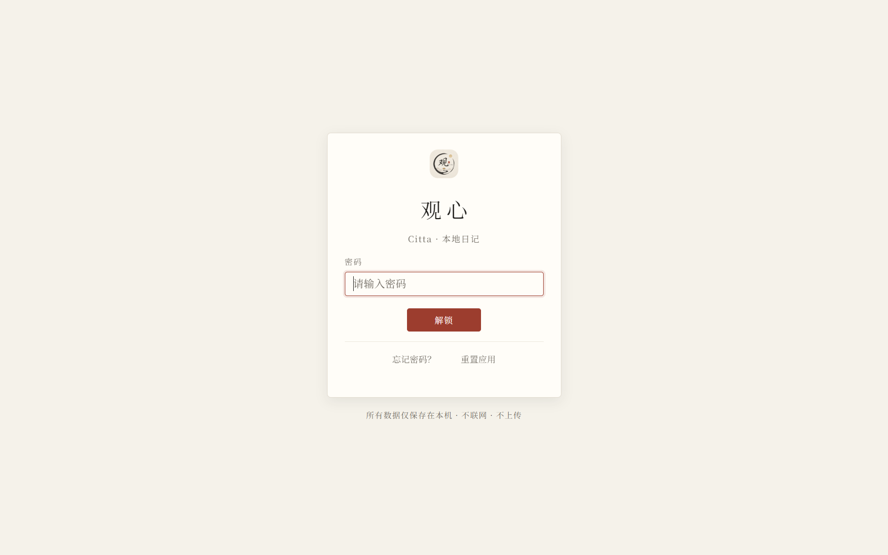

# 观心 Citta

[简体中文](README.md) · **English**

A local-first, fully offline, encrypted personal diary for the desktop: a calendar is the entry point, one page per day, written in Markdown, and everything stays on this machine.


> 观心 (guān xīn) — to look into your own mind. *Citta* (चित्त) is Sanskrit for "mind".

## Table of contents

- [What it is](#what-it-is)
- [Features](#features)
- [Screenshots](#screenshots)
- [Quick start](#quick-start)
- [Build & test from source](#build--test-from-source)
- [Build the portable app](#build-the-portable-app)
- [Data & privacy](#data--privacy)
- [Technical notes](#technical-notes)
- [Known limitations](#known-limitations)
- [Project layout](#project-layout)
- [License](#license)
- [Credits](#credits)

## What it is

观心 Citta is a personal diary application for Windows: it opens on the current month's calendar, you click a day and write a page, using Markdown for the text and quick controls for mood, weather and tags. Every entry and every image is encrypted on disk before it is stored; the app makes no network requests, uploads nothing, needs no account and has no cloud sync.

It is meant for people who want journalling to become a long-term habit without handing their private writing to a third-party service: the interface follows a paper-and-ink design language — quiet, restrained, and comfortable to look at for years.

## Features

### Diary and calendar

| Feature | Description |
| --- | --- |
| Calendar view | A regular month grid starting on Monday; each day also shows the Chinese lunar date, the 24 solar terms, and traditional and solar festivals |
| Year/month picker | Click the calendar title (e.g. "2026 年 9 月") to open the picker: 12 months, then click the year to switch to year selection (12 years per page, whole pages at a time); `Esc` or a click elsewhere closes it |
| Date awareness | Clicking any day shows "Today / Yesterday / N days ago / N days from now" and the details of that day in the side panel |
| Mood | 1–5 per day; the calendar cell carries a 9px **mood-coloured dot** (the colour is the mood), and the list shows a five-dot scale |
| Weather | Sunny / cloudy / overcast / light rain / heavy rain / thunderstorm / snow / fog / wind |
| Highlight | Optional, one line of up to 80 characters for what mattered that day, without any decorative symbol in the calendar cell |
| Tags | Autocomplete from existing tags while typing, plus pinning an entry to the top |
| Timestamps | Every entry records when it was created and when it was last modified, shown at the bottom of the detail view |

### Editing and Markdown

| Feature | Description |
| --- | --- |
| Split view | Editor on the left, live preview on the right, divided by a 1px rule |
| Syntax | Headings level 1–3, bold, italic, strikethrough, ordered and unordered lists (with nesting), quotes, horizontal rules, links, inline code, code blocks, images |
| First-line indent | The preview indents the first line of every paragraph, two characters by default; 1 / 2 / 4 characters or off can be chosen and the choice is remembered |
| Autosave | A draft is saved every 20 seconds while editing, and the final content is saved when the editor is closed; `Ctrl+S` saves manually |
| Images | Insert a local image from the toolbar, paste with `Ctrl+V` inside the editor, click an image in the preview to zoom in; images are stored encrypted together with the entry |
| Paragraphs | One press of Enter starts a new paragraph (the editor inserts the blank line between paragraphs for you), which is also how Markdown defines a paragraph |

### Search and organisation

| Feature | Description |
| --- | --- |
| Full-text search | Searches titles and body text at once and **highlights** the matching fragments |
| Filters | Filter by year, by month and by tag, plus a "pinned" category |
| Backup and restore | Export a JSON backup (including images); import either by overwriting or by merging (only dates that are missing are added) |
| Scroll memory | Returning from the editor to the list restores the previous scroll position |
| Context menus | Right-click a calendar cell or a list item for edit, pin, export this day, delete this day |
| Global shortcuts | `Ctrl+N` write today's entry · `Ctrl+S` save manually · `Ctrl+F` search · `Ctrl+D` back to today · `Ctrl+1/2/3` switch calendar / journal / stats · `Esc` close an overlay or go back |

### Statistics

| Feature | Description |
| --- | --- |
| Writing overview | Four bordered tiles: total entries, total characters, consecutive writing days, entries this month |
| Monthly mood distribution | The five mood levels of the month as ink dots with a legend, plus entries this month, how many recorded a mood, and the average |
| Yearly one-dimensional timeline | Hand-written inline SVG: a 1px horizontal line with one point per month, where the density of the ink dot is that month's mood |
| Mood trend | A single very pale ink band, like a dry brush stroke |
| Frequent tags | A tag cloud ordered by how often each tag is used |
| Year summary | Entries and characters written this year, the current streak, and the totals overall |
| Chart choices | The stats page contains only lines, dots and white space: no pie charts, no donut charts, and no bar charts with gridlines |

### Appearance and language

| Feature | Description |
| --- | --- |
| Themes | Light "宣纸" (paper), dark "墨夜" (ink night), or follow the system — switchable in Settings; the preference is applied before the first frame (no white flash) and the window title bar follows it |
| Language | Chinese (default) and English, switchable in Settings and applied immediately; what you wrote yourself is never translated |
| Settings panel | Appearance, language, editor indent display, local data (including "open data directory"), export backup, import backup, change password, security questions, clean up unused images, lock the app, reset the app |
| App icon | The window and taskbar icon comes from `logo.ico` in the project root, while `logo.png` is used inside the interface; replace the files and restart, no code change needed |
| Responsive | Narrowing the window collapses the side panel and switches to a single-column layout |

### Data and security

| Feature | Description |
| --- | --- |
| Startup password lock | The first run guides you through setting a startup password (at least 4 characters) and three security questions; afterwards the app asks for the password on every start |
| Recovery | Answering **any one** of the three security questions is enough to reset the password |
| Change password | Only the master key is re-wrapped, so existing entries never need re-encryption |
| Lock | Clears the keys held in memory at any time and returns to the lock screen |
| Reset | If both the password and the answers are lost, the app can be reset; the interface states clearly that this **erases all local data** and requires typing a confirmation phrase |
| Encrypted storage | Every entry and every image is encrypted with AES-256-GCM (each with its own IV); only ciphertext ever reaches the disk |
| Fully offline | The app makes no network requests; external links are handed to the system browser |

## Screenshots

| Calendar | Markdown editor |
| --- | --- |
|  |  |
| Lunar dates, the 24 solar terms and festivals share a cell; the small dot in each cell is that day's mood | Write on the left, live preview on the right; paragraphs are auto-indented |

| Statistics | Dark theme |
| --- | --- |
|  |  |
| Writing overview, monthly mood distribution, and a hand-written inline-SVG yearly timeline | The vermilion is lightened in dark mode for comfortable night reading |



> Screenshots are generated by `tools/make-screenshots.js`: it launches a real Electron
> instance, seeds fictional demo entries into an **isolated temporary data directory**
> (your real diary is never touched), and captures each screen.

## Quick start

### Option 1: portable build (regular users)

1. Unzip the `观心 Citta-win-x64` folder (see [Build the portable app](#build-the-portable-app)).
2. Double-click `观心 Citta.exe` inside it.
3. The first run guides you through setting a **startup password** and **three security questions**; after that the app asks for the password on every start.

Diary data is not kept in the program folder — it is written to `%APPDATA%\观心 Citta`, and the "open data directory" button in Settings takes you straight there.

### Option 2: from source

You need [Node.js](https://nodejs.org/) with npm. The only dependency of this project is Electron (a development dependency), and installing it for the first time requires access to an npm registry.

**The simplest way: double-click `启动观心.bat` in the project root.** On first use it runs `npm install` for you, after which a double-click opens the app straight away.

From a command line:

```powershell
npm install   # only needed the first time
npm start
```

## Build & test from source

| Command | What it does |
| --- | --- |
| `npm start` | Start the app with Electron |
| `npm run dev` | Start the app with the `--dev` flag |
| `npm test` | Run all six test suites (entry point `tests/run.js`) |
| `npm run test:lunar` | Run only the lunar / solar-term / festival algorithm tests (plain Node, no Electron) |
| `npm run test:storage` | Run only the storage and encryption tests (needs the Electron main process) |
| `npm run test:e2e` | Run only the end-to-end UI flow (opens a real window and drives it) |
| `npm run build:lunar-table` | Regenerate the lunar fallback table and self-check it, writing `src/shared/lunar-table.json` |
| `node tools/audit-visual.js` | Static audit of the visual rules: design tokens, forbidden list, minimum font sizes |

The six suites that `npm test` runs, in order:

1. Lunar / solar-term / festival algorithm (plain Node)
2. Markdown renderer (plain Node)
3. Storage, encryption and backup
4. Visual rules: reads computed styles and layout geometry from a real window and computes WCAG contrast for both the light and the dark theme
5. Content fidelity: saving does not damage the original text
6. End-to-end UI flow (opens a real Electron window, drives the UI, and measures load, list and search time for 1000 entries)

Suites 3–6 need the Electron executable (`node_modules/electron/dist/electron.exe`); if dependencies are not installed, `npm test` skips them and says so in the results.

## Build the portable app

```powershell
npm run dist
```

> Note: `npm run dist` runs `tools/build-portable.js`, a zero-dependency script that copies the Electron runtime from `node_modules/electron/dist` and drops the app into `resources/app/`. No network access and no packaging dependency are required.

### Size

Electron bundles a whole Chromium, so the portable folder is **about 225 MB uncompressed and about 62 MB as a 7z archive** (a zip lands near 90 MB). The script trims two things by default:

- keeps only the `zh-CN` and `en-US` locale packs and drops the other 53 (saves about **38 MB**)
- drops the `vk_swiftshader.dll` / `vulkan-1.dll` software-rendering fallback (saves about **6 MB**) — if your target machine is a VM without graphics drivers, run `node tools/build-portable.js --keep-swiftshader` to keep them

The build then produces `dist/观心 Citta-win-x64.1.0.0.7z` with 7z (LZMA2, maximum) as the release artifact, falling back to a zip when 7z is not installed. Pass `--no-pack` to skip archiving.

Going meaningfully below this means replacing the Electron shell with the system WebView2 (for example Tauri), which is a rewrite and out of scope for this project.

The build produces the folder `dist/观心 Citta-win-x64/`, a **portable** directory: the user unzips it and double-clicks `观心 Citta.exe`, with no installer and no administrator rights needed.

The folder contains two parts:

| Content | Description |
| --- | --- |
| `观心 Citta.exe` | The application executable |
| Electron runtime | `*.dll`, `*.pak`, `locales/`, `resources/` and so on, bundled so the user's machine needs neither Node nor Electron preinstalled |
| `resources/app/` | The project source (`src/`, `package.json`, `logo.ico`, …) — the application itself |

**Diary data is not inside this folder.** Whether you run from source or from the portable build, entries are written to Electron's `userData` directory `%APPDATA%\观心 Citta`, which means:

- the build output — and any archive you share — contains **no personal data**;
- upgrading is just replacing the old folder with the new one; existing entries are unaffected;
- for backups and migration use "export backup" in Settings (see [Data & privacy](#data--privacy)).

A portable directory is simply a complete Electron runtime directory plus the application code, so it can also be assembled by hand: copy `node_modules/electron/dist/` into a new folder, put the project files into its `resources/app/`, and rename the executable to `观心 Citta.exe`.

## Data & privacy

Everything lives in Electron's `userData` directory, which on Windows is `%APPDATA%\观心 Citta` (the "open data directory" button in Settings opens it directly):

| File / directory | Content |
| --- | --- |
| `vault.json` | The key store: **verification data** for the password and the security answers, plus the wrapped master key; it contains no plaintext password and no plaintext answer |
| `entries.json` | All entries as ciphertext: each entry is encrypted separately with its own IV |
| `images/` | Image ciphertext, one `<id>.bin` per image, encrypted exactly like the entries |
| `backups/` | The backup directory created by the storage layer (the export dialog lets you pick another location) |
| `prefs.json` | The only plaintext file: it stores interface preferences only (the theme: `"light"` / `"dark"` / `"system"`) and no diary content; the language preference is likewise stored as an interface preference inside the local `userData` directory |

### How the encryption works, in plain language

1. When you first set a password, the app generates a random **master key**; every entry and image is then encrypted with it using AES-256-GCM.
2. The master key itself is never written to disk directly: it is wrapped by a "password key" and stored in `vault.json`, and that password key is derived from your password with scrypt (N=16384, r=8, p=1).
3. This is why **changing the password only re-wraps the master key** — the entries never have to be re-encrypted.
4. Each of the three security answers derives its own key and wraps its own copy of the master key; answering any one of them recovers the master key.
5. Keys exist **only in memory** and disappear when the app is locked or the process exits; only ciphertext is ever on disk.
6. A single corrupted ciphertext does not affect the other entries — that one day is simply flagged as failing to decrypt.

### About backup files (important)

> **Exported backup JSON files are plaintext.** They contain every entry and image, and they are deliberately not encrypted so that moving to another machine is easy.

Keep backup files safe: do not share them casually and do not put them behind a public cloud link. For long-term archiving, store them on a disk or in an encrypted archive that you control.

## Technical notes

### Lunar calendar and solar terms: self-implemented, zero dependencies

No prebuilt lunar data package is used; everything is computed from astronomical algorithms:

| Step | Method |
| --- | --- |
| 24 solar terms | **VSOP87D** truncated series for the Earth's heliocentric longitude plus nutation in longitude, with **Newton iteration** on the moment the Sun's apparent longitude reaches an integer multiple of 15°; the moment is converted from TT to Beijing time through **ΔT** (Espenak–Meeus polynomials) |
| Moon and new moon | **Meeus, *Astronomical Algorithms*, chapter 47** for the Moon's apparent longitude and **chapter 49** for the moment of new moon, then iterating until the difference of the apparent longitudes of Sun and Moon is zero |
| Calendar rules | **GB/T 33661-2017** (*Calculation and promulgation of the Chinese calendar*): the day boundary is UTC+8, the new-moon month containing the winter solstice is month 11, following months are numbered in order while they contain a major solar term, and a month without one is a leap month |
| Fallback data | `src/shared/lunar-table.json` holds the authoritative spring festival dates for 1901–2100 (200 records) and the leap-month table, generated and self-checked by `tools/build-lunar-table.js`, guaranteeing agreement with the official almanac on the main path |

Verification results:

| Item | Result |
| --- | --- |
| Spring festival dates | Full comparison against the authoritative table, 1901–2030: **131/131 correct** |
| Lunar year structure | 1901–2099: **0 anomalies** |
| Month-by-month comparison | 2022 compared with the official almanac: **12/12 match** |
| Solar term moments | Match the official publications to the minute |

### Encryption design

```
password ──scrypt──▶ password key ──wraps──▶ ┌────────────┐
                                             │ master key │ ──AES-256-GCM──▶ every entry & image
security answer ─scrypt─▶ recovery key ─wraps▶ └────────────┘
```

| Parameter | Value |
| --- | --- |
| Cipher | AES-256-GCM (authenticated encryption), a separate 12-byte IV per record, 16-byte authentication tag |
| Key derivation | scrypt with N=16384, r=8, p=1, deriving a 32-byte key |
| Master key | 32 random bytes, kept in memory only; only its wrapped form is on disk |
| Writing to disk | Written to a `.tmp` file and then `rename`d over the target to avoid half-written files; consecutive saves are throttled and merged over 400ms |

### Performance

Measured on the development machine with 1000 entries:

| Item | Measured |
| --- | --- |
| Loading all entries | about 9ms |
| Rendering the list | about 15ms |
| Full-text search | <1ms |

The end-to-end suite guards the same operations with thresholds: load <2500ms, list <1500ms, search <200ms.

### Renderer hardening

- The renderer runs with `contextIsolation` enabled and `nodeIntegration` disabled, and a **CSP** restricts where resources may come from: `default-src 'self'; img-src 'self' data: citta-img:; style-src 'self' 'unsafe-inline'; script-src 'self'`.
- The renderer has no access to Node, no access to the keys, and cannot read or write files; all data access goes through IPC via the minimal API exposed by `preload.js`, and the main process wraps every handler so that exceptions become error messages (no stack traces are handed to the UI).
- All HTML produced by the Markdown renderer is escaped and only whitelisted tags are emitted; links allow only `http` / `https` / `mailto`, and images allow only `data:image/*` and the local `citta-img://<32 hex digits>` scheme.
- External links are always opened by the system browser; the app itself never navigates.
- Lunar calculations happen in the main process, and the renderer only receives the finished plain data.

## Known limitations

- The **authoritative lunar fallback table covers 1901–2100**; dates outside that range are not guaranteed (the app is a personal diary, so everyday use is unaffected).
- **Backup files are plaintext**: a deliberate trade-off for migrating between machines. Keep them safe and do not share them.
- **In English mode the lunar, solar-term and festival text stays in Chinese** — it is Chinese calendar data and is deliberately not translated (the i18n layer translates interface text only; the entries, tags, highlights and search snippets you wrote are never translated).
- Windows only for now; there is no cloud sync, no multi-device use and no mobile app — the data stays on one machine.
- **The `.exe` file icon** is still Electron's default (the window and taskbar icons are Citta's own logo). Changing PE resources needs an extra tool.
- **The release artifact is about 62.5 MB**: that is the Chromium runtime Electron ships, not the application (the app itself is 2.2 MB). Getting below 10 MB means replacing the shell — see [`docs/MIGRATION-TAURI.md`](docs/MIGRATION-TAURI.md) for the assessment.

## Known issues

The following were surfaced by the project's own test suite and are **left unfixed**
for now, documented here on purpose.

### Contrast: calendar dates miss the project's own floor

`tests/visual.test.js` measures WCAG contrast ratios inside a real window. It treats
body text, calendar dates, month titles and list entry text as **must-read (>= 7, AAA
level)**, and secondary text as >= 4.5.

| Element | Measured | Project floor | Result |
| --- | --- | --- | --- |
| Calendar date (light) | 5.7 | >= 7 | below floor |
| Calendar date (dark) | 5.95 | >= 7 | below floor |
| Dark theme weekday dates | 5.95 | >= 7 | below floor |

Note that 5.7 already satisfies WCAG **AA** (4.5 for normal text); it just misses the
stricter bar this project set for itself. The lighter ink is part of the "rice paper and
ink" design language, so darkening it was not done unilaterally.

### English UI: lunar festival names are untranslated

After switching to English, lunar festival names (e.g. the Chinese string for
National Day) stay in Chinese. Everything else in the UI is translated, and
`tests/e2e.js` asserts that `CittaI18n.untranslated()` is empty, so this one
assertion fails.

It overlaps with the design trade-off noted above: lunar dates, solar terms and
festivals are Chinese calendrical data. The current intent is "translate UI chrome,
keep calendrical data Chinese", but festival names happen to be rendered through the
UI path, so the untranslated-check catches them. Either add them to the translation
table or exempt them explicitly -- not yet decided.

### How CI handles this

In `.github/workflows/ci.yml`:

- **Gate**: the two pure-Node suites (lunar, markdown) must pass or CI fails
- **Report**: the full six-suite run still executes and logs, but does not currently
  gate the build

That way genuine regressions fail fast, while the two known issues above do not keep
CI permanently red. Once they are fixed, drop `continue-on-error` from the
"Run full suite" step to promote it to a gate.

## Project layout

```
logo.ico                        app icon (window and taskbar, 9 sizes from 16 to 256)
logo.png                        the original app icon (shown inside the interface)
Markdown写法演示_1900-01-01.md   Markdown syntax demo (copy the whole thing into the entry for 1900-01-01)
package.json                    script entry points and the single development dependency (Electron 33)
启动观心.bat                     one-click Windows launcher (installs dependencies on first run)
README.md / README.en.md        Chinese and English documentation
LICENSE                         MIT license
src/
  main/                         main process
    main.js                     window, IPC, backup dialogs, calendar computation, icon loading
    preload.js                  the minimal API exposed through contextBridge
    storage.js                  local storage (entries / images / backups / garbage collection)
    crypto.js                   scrypt derivation + AES-256-GCM + key wrapping
  shared/
    lunar.js                    lunar / solar-term / festival algorithms (about 1200 lines, zero dependencies)
    lunar-table.json            authoritative 1901–2100 fallback data (spring festival dates and leap months)
  renderer/                     renderer (plain scripts + native DOM, no framework, no bundler)
    index.html                  page skeleton and CSP
    styles/base.css             design system: theme tokens, typography and control base
    styles/views.css            styles for each view
    lib/markdown.js             lightweight Markdown renderer (with whitelist filtering)
    js/theme.js                 theme (sets data-theme before the first frame and syncs it to the main process)
    js/i18n.js                  interface language (Chinese / English; translates the UI only, never user content)
    js/store.js                 front-end data layer (cache, search index, subscriptions)
    js/ui.js                    DOM / date helpers, modals, context menus, image rendering
    js/lock.js                  lock-screen state machine (setup / unlock / recovery / reset)
    js/editor.js                Markdown editor (including the five-colour mood picker)
    js/calendar.js              calendar view (including the year/month picker)
    js/list.js                  list, filters, search, export
    js/stats.js                 statistics and hand-written SVG charts
    js/settings.js              settings panel
    js/app.js                   main controller and global shortcuts
tools/
  build-lunar-table.js          generates and self-checks the lunar fallback table
  audit-visual.js               static audit of the visual rules (tokens, forbidden list, minimum font sizes)
tests/                          six suites (algorithm / Markdown / storage & encryption / runtime visuals / content fidelity / end-to-end)
```

## License

Released under the **MIT** license; see [`LICENSE`](LICENSE).

## Credits

- The lunar and solar-term algorithms follow Jean Meeus, *Astronomical Algorithms* (chapter 47 for the Moon's position, chapter 49 for the moment of new moon) and the VSOP87D series; the calendar rules follow **GB/T 33661-2017** (*Calculation and promulgation of the Chinese calendar*); ΔT uses the Espenak–Meeus polynomials.
- The interface prefers Source Han Serif SC / Noto Serif SC, falling back to system serif fonts (Song-style) when they are not installed.
- There are no third-party runtime dependencies; the only development dependency is [Electron](https://www.electronjs.org/).
